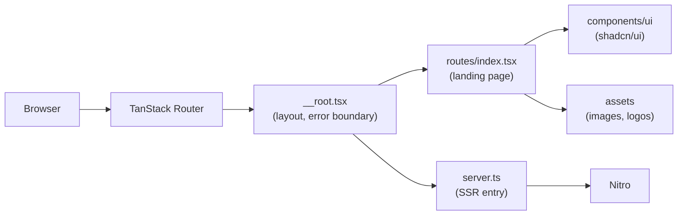
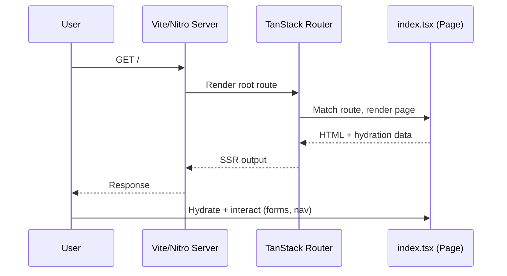
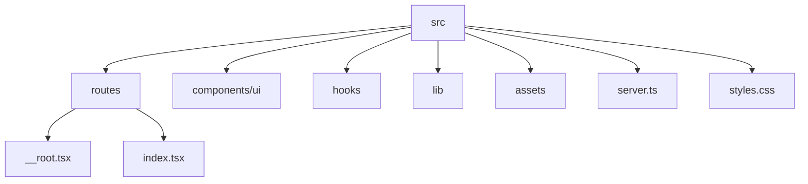

# Drigroamers Logistics

A [TanStack Start](https://tanstack.com/start) app built with React 19, Tailwind CSS 4, and shadcn/ui (Radix primitives).

## Architecture



## Request Flow



## Tech Stack

- **Framework:** TanStack Start + TanStack Router
- **UI:** React 19, Tailwind CSS 4, shadcn/ui, Radix UI, lucide-react
- **Forms/data:** react-hook-form, zod, @tanstack/react-query
- **Tooling:** Vite, ESLint, Prettier, TypeScript

## Prerequisites

- [Bun](https://bun.sh) (or Node.js if you prefer npm/pnpm)

## Getting Started

```bash
bun install
bun run dev
```

The app will be available at `http://localhost:3000` (default Vite dev port).

## Scripts

| Command             | Description                        |
| -------------------- | ----------------------------------- |
| `bun run dev`         | Start the dev server                |
| `bun run build`       | Production build                    |
| `bun run build:dev`   | Development-mode build              |
| `bun run preview`     | Preview the production build        |
| `bun run lint`        | Run ESLint                          |
| `bun run format`      | Format code with Prettier           |

## Project Structure

